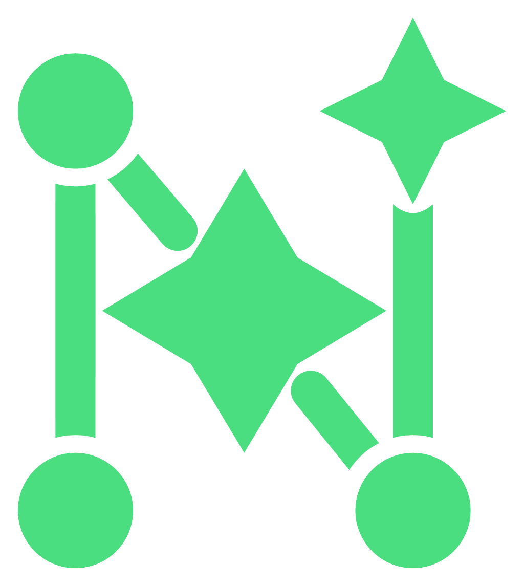

  

<h1 align="center">NoteBrain AI — Desktop</h1>

  <strong>Local-first, AI-powered knowledge management</strong> 
  Desktop app for macOS, Windows, and Linux.

  <a href="https://notebrain.ai">Website</a> &bull;
  <a href="https://app.notebrain.ai">Web App</a> &bull;
  <a href="https://github.com/notebrain-ai/notebrain-ai/releases/latest"><strong>Latest Release</strong></a> &bull;
  <a href="CHANGELOG.md">Changelog</a>

---

## Download

The desktop app is **free** on all platforms. Grab the build for your OS from the [latest release](https://github.com/notebrain-ai/notebrain-ai/releases/latest):

| Platform | Asset |
|----------|-------|
| **macOS** (Apple Silicon) | `*-arm64.dmg` |
| **macOS** (Intel) | `*-x64.dmg` |
| **Windows** | `*-Setup.exe` (installer) or `*-portable.exe` |
| **Linux** | `*.AppImage` or `*.deb` |

The [download page on notebrain.ai](https://notebrain.ai/download) auto-detects your OS and points to the right asset.

Auto-update is wired through this release feed — once installed, the app keeps itself current.

## What is NoteBrain AI?

A local-first second brain with rich text, canvas, kanban, table, todo, gantt, mind map, and timeline editors — plus AI chat grounded in your own notes (RAG). Your data stays on your device unless you opt into the Cloud plan.

Full feature tour and pricing on **[notebrain.ai](https://notebrain.ai)**.

## About this repo

NoteBrain AI is **closed-source**. This repository exists only for:

- 📦 Publishing desktop release binaries (this is what the app auto-updater reads)
- 🐛 [Bug reports](../../issues/new?template=bug_report.yml)
- 💡 [Feature requests](../../issues/new?template=feature_request.yml)
- 📜 [Changelog](CHANGELOG.md)

There is no source code in this repository. The app is a paid SaaS with a free desktop tier; the source lives in a private repository.

## License

NoteBrain AI is proprietary software. See [LICENSE](LICENSE) for terms. Third-party components are listed in [THIRD_PARTY_LICENSES.md](https://github.com/notebrain-ai/notebrain-ai/blob/main/THIRD_PARTY_LICENSES.md) once published.

---

  <a href="https://notebrain.ai">notebrain.ai</a>

